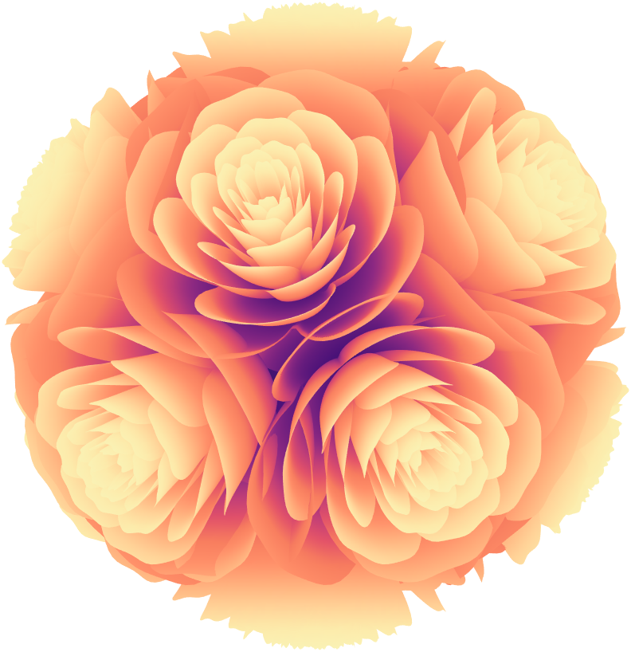
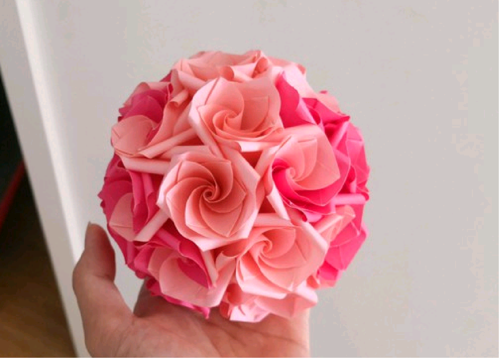
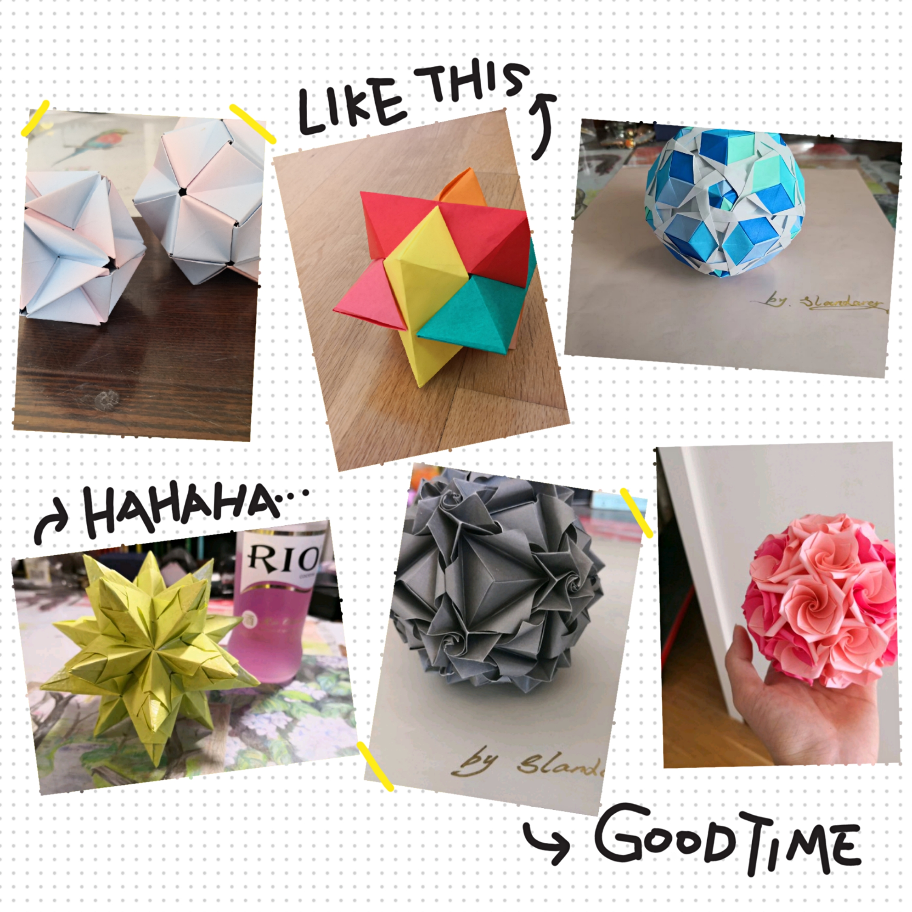

# roseball
Draw a roseball using MATLAB.


```matlab
roseball()
```


```matlab
CList = [.21 .09 .38; .29 .07 .47; .40 .11 .49; .55 .16 .51;
         .75 .24 .47; .89 .32 .41; .97 .49 .37; 1.0 .56 .41;
         1.0 .69 .49; 1.0 .82 .59; .99 .92 .67; .98 .95 .71];
roseball(gca, CList)
```

```matlab
CList = [.13 .10 .16; .20 .09 .20; .28 .08 .23; .42 .08 .30;
         .51 .07 .34; .66 .12 .35; .79 .22 .40; .88 .35 .47;
         .90 .45 .54; .89 .78 .79];
roseball(CList)
```


## Schematic Diagram


## 🎨 Inspiration
It is worth mentioning that this rose ball was inspired by an origami flower ball I made when I was very young. 


Other origami flower balls can be found here:
